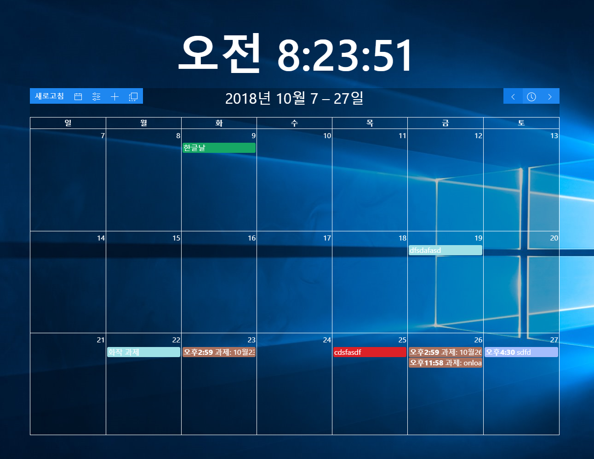
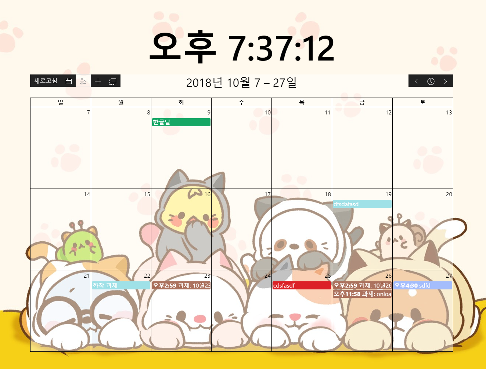

# Desktop-Calendar-Page
> [Desktop-Calendar](https://github.com/LETS-BEE/Desktop-Calendar)설명용

> 이 프로젝트는 tbvjaos510의 [DesktopCalendar](https://github.com/tbvjaos510/DesktopCalendar)를 Clone하였습니다.

> 일부 디자인 수정을 위해 시작했는데 너무 많이 고쳐서 새로 저장소를 만들었습니다.

## Stacks
* [NodeJS](https://nodejs.org/) ver.16.16.0 LTS
* [Electron-Vue](https://github.com/SimulatedGREG/electron-vue)
* [Electron-Builder](https://github.com/electron-userland/electron-builder)
* [Vuex](https://github.com/vuejs/vuex)
* [UIkit](https://getuikit.com/)
* [Google Calendar API](https://developers.google.com/calendar/)
* [FullCalendar v3](https://fullcalendar.io/docs/v3)
* [electron-disable-minimize](https://github.com/tbvjaos510/electron-disable-minimize)

# Program Images
## White

## Black

***

# ChangeLog
## 3.0.3 (Lastest)
* [fix] 다중 모니터가 서로 다른 배율일 때 크기 및 위치 오류 수정
* [fix] 모니터 범위 밖으로 벗어나 이동할 수 없는 경우 수정

## 3.0.2
* [fix] 2일 이상 일정 정상 표시
* [fix] 일정을 추가할 때 날짜, 날짜-시간 변경 시 시간 정상 표시
* [add] 다중 모니터 지원

## 3.0.1
* [fix] google의 oauth 2.0 정책 혹은 "urn:ietf:wg:oauth:2.0:oob" 오류 수정
* [add] 달력 위치 저장 기능 추가

## 3.0.0
* Node.js 버전을 16.16.0 LTS로 변경
* electron 13으로 변경
* vue-cli 3로 변경
* Vue3에 맞는 Package사용
* Vue2버전 전용 문법 삭제
* 일부 디자인 변경
* [fix] 빠르게 달력 이동 시 이벤트 중복 추가 수정

이전 버전(tbvjaos510)

## 2.0.0
* electron 2에서 7로 업데이트
* electron-vue 와의 종속성 제거
* eslint 제대로 사용
* electron-disable-minimize 모듈 수정 및 업데이트

## 1.3.0
* [fix] 바탕화면 보는 모듈을 직접 제작 및 연결 완료 - #bb6f13d
* [add] 시간 색 설정을 직관적으로 보이게 하고 기존 css설정을 고급 설정으로 옮김 - #0349495
* [add] 달력 높이 설정을 텍스트에서 range로 변경 - #a20f47c
* [fix] 이벤트가 하루에 많을 때 전부 표시되도록 변경 - #34b7f93
* [add] 설정 창에 현재 버전 표시 - #b47c85f

## 1.2.1
* [fix] 바탕화면 보기 (Window + D) 키를 누를 시 프로그램이 숨겨지던 오류 수정 (c++ 수정)

## 1.2.0
* [fix] 프로그램이 Alt + f4로 종료되지 않게 수정
* [fix] 프로그램이 시작시 포커스를 얻는 오류 수정
* [add] 이벤트 추가시 원하는 달력 선택 가능
* [add] 달력 뷰 수정 가능 (한달보기 3주보기)
* [add] 달력 높이 수정 가능

## 1.1.1
* [fix] 토큰 만료기간이 지날 시 refresh 되지 않는 현상 수정
* [add] 달력 새로고침 시간 설정 기능
* [add] 요일별 이벤트 추가 기능

## 1.1.0
* [fix] 마우스 이벤트 무시를 jquery에서 vue event로 변경
* [add] 처음 설치 시 새로운 창 추가
* [add] 원하는 달력 선택 가능
* [fix] 설정 파일 저장위치 변경
* [fix] 인스톨러에서 설치 경로 선택 가능

## 1.0.1 Pre-release
* [fix] 이벤트 추가시 날짜 선택에서 마우스 무시 현상 수정
* [fix] 해상도에 맞게 픽셀이 아닌 비율로 수정
* [add] 달력 색 설정 추가 [텍스트 및 테이블 색, 배경 색]

## 1.0 Pre-release
* 1.0 베타 버전 배포

